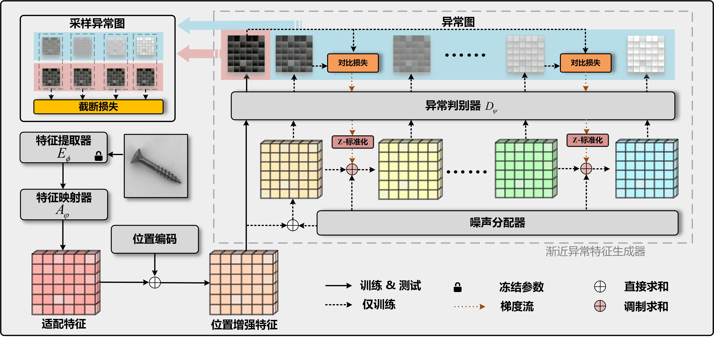

# CASS-AMD

CASS-ADM: A Controlled Anomaly Synthesis Strategy with Asymptotic Diffusion Modulation for Image Anomaly Detection and Localization

# Introduction
This repository contains source code for two CASS-ADM variants implemented with PyTorch. The CASS-ADM series employs a controllable feature-level anomaly synthesis method, incorporating three core components: a Noise Distributor, a Gradient-Guided Direction Awareness module, and an Adaptive Direction Regulation module, to achieve decoupling control of feature-level noise intensity and direction.

**CASS-ADMS**: a lightweight version that uses only the feature-level anomaly synthesis strategy and does not require any external data sources.

**CASS-ADMM**: a dual-level version that combines image-level and feature-level anomaly synthesis and leverages the external DTD texture dataset.

Both variants are built on the same network architecture.
| Metric   | MVTec AD | VisA  | MPDD  | MVTec LOCO  |
|----------|----------|-------|-------|-------------|
| I-AUROC  | 99.9%    | 98.8% | 99.6% | 100%        |
| P-AUROC  | 99.3%    | 98.8% | 99.4% | 98.9%       | 
|  AUPRO   | 99.3%    | 98.8% | 99.4% | 98.9%       | 
# Data Preparation
DTD is an auxiliary texture dataset used only for training CASS-ADMM, while the other datasets are used for anomaly detection evaluation.
- [DTD](https://www.robots.ox.ac.uk/~vgg/data/dtd/)
- [MVTec AD](https://www.mvtec.com/research-teaching/datasets/mvtec-ad)
- [VisA](https://github.com/amazon-science/spot-diff/)
- [MPDD](https://github.com/stepanje/MPDD/)
- [MVTec LOCO](https://www.mvtec.com/research-teaching/datasets/mvtec-loco-ad)
  
Please keep the dataset folders in their original directory structures.

# Environments

```python
conda create -n cassadm python=3.11.15
conda activate cassadm
pip install -r requirements.txt
```
Our experiments were conducted on an RTX 4080 Super GPU. Please use the same configuration whenever possible.

# Run MVTec-AD
Edit `./shell/run_mvtec.sh` to configure arguments `--datapath` `--augpath` `--classes` `--test`.

Set `--augpath` to None for CASS-ADMS. To use CASS-ADMM, set --augpath to the path of an external texture dataset.

Set `--test` to an empty string (`''`) to train the model. To test the model, set `--test` to the checkpoint filename, such as `best_roc.pth`.

# Acknowledgements
We gratefully acknowledge the inspiration provided by [SimpleNet](https://github.com/DonaldRR/SimpleNet/) and [GLASS](https://github.com/cqylunlun/GLASS#data-preparation).

# License
All code within the repo is under [MIT license](https://mit-license.org/)

